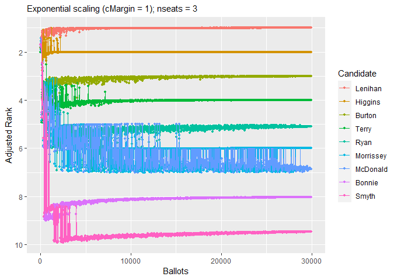
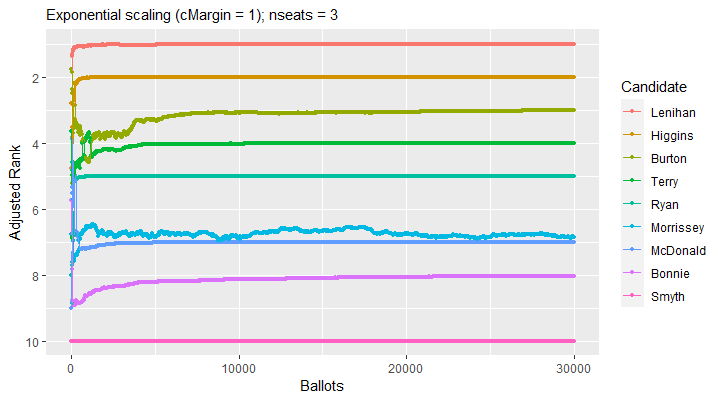

<!-- README.md is generated from README.Rmd. Please edit that file -->

```{r, include = FALSE}
knitr::opts_chunk$set(
  collapse = TRUE,
  comment = "#>",
  fig.path = "man/figures/README-",
  out.width = "100%"
)
```

# SafeVote

<!-- badges: start -->

<!-- badges: end -->

The goals of SafeVote are to investigate the safety of announcing
preliminary results from an election, and to allow experimental study of
the safety of a complete ranking of all candidates (as in a party list)
that is derived from a small-scale election with preferential ballots.

## Installation

You can install the development version of SafeVote from
[GitHub](https://github.com/) with:

``` r
# install.packages("devtools")
devtools::install_github("cthombor/SafeVote")
```

## Examples

This mod of
[vote.2.3-2](https://cran.r-project.org/web/packages/vote/index.html)
reports the margins of victory in an election.

The value of the `safety` parameter will affect the completeness of the
safeRank ordering of the candidates. Setting `safety = 0` will cause
safeRank to be a total ranking of the candidates, except in the rare
case that there is an exact tie. The "fuzz" $z$ on the
vote-differentials in a safeRank clustering of the candidates is
$z = s\sqrt{n}$, where $s$ is the value of the safety parameter and $n$
is the number of ballots.

``` r
    library(SafeVote)
    data(food_election)
    stv(food_election)
    stv(food_election, safety=0.25)
    stv(food_election, safety=0)
```

A few safety-testing routines are supplied, to support experimental
study of the statistical behaviour of ballot counting methods. For
example, `testFraction` draws a series of independent samples from a
ballot box, which we expect to be helpful in estimating the number of
ballots required to form a stable result. As seen below, in the case of
the [dublin_west](dublin_west) dataset, only a few thousand ballots are
sufficient to reliably determine the three winners (Lenihan, Higgins,
Burton). By contrast, the relative ranking of Ryan and Morrissey is
still somewhat unstable when the last few thousands of ballots are being
counted.

``` r
data(dublin_west)
plot(testFraction(dublin_west,astart=8,ainc=20,countArgs=list(nseats=3)))
```



[testAdditions](testAdditions) can be used to assess the sensitivity of
an STV election to a tactical-voting strategy of "plumping" for a
favoured candidate. For example, we find it takes only two "plumping"
ballots to shift "Strawberries" from third place to second place in the
[food_election](food_election) dataset. Note that in this test we have
set the `safety` parameter of the [stv](stv) ballot-counting method to
zero, so that the output of [testAdditions](testAdditions) reveals a
complete ranking of the candidates unless there is an exact tie.

``` r
data(food_election) 
testAdditions(food_election, arep = 2, favoured = "Strawberries", 
  countArgs = list(safety = 0))
#> 
#> Adding up to 2 stv ballots = ( 3 5 4 1 2 )
#> Testing progress:  1, 2
#> 
#> Results of testAdditions at 2022-12-26 08:25:22
#> 
#> Dataset = food_election, countMethod = stv, rankMethod = safeRank
#> 
#> |          | safety|
#> |:---------|------:|
#> |countArgs |      0|
#> 
#> 
#> |             | ainc| arep|                                                         tacticalBallot|
#> |:------------|----:|----:|----------------------------------------------------------------------:|
#> |otherFactors |    1|    2| c(Oranges = 3, Pears = 5, Chocolate = 4, Strawberries = 1, Sweets = 2)|
#> 
#> Experiment ID, number of ballots in simulated election, ranks, winning margins:
#> 
#> |exptID | nBallots| Oranges| Pears| Chocolate| Strawberries| Sweets| m.Oranges| m.Pears| m.Chocolate| m.Strawberries|  m.Sweets|
#> |:------|--------:|-------:|-----:|---------:|------------:|------:|---------:|-------:|-----------:|--------------:|---------:|
#> |SBK0   |       20|       2|     5|         1|            3|      4| 1.4451111|       2|           8|      1.7774444| 0.7774444|
#> |SBK1   |       21|       2|     5|         1|            3|      4| 0.6673333|       2|           8|      2.6663333| 0.6663333|
#> |SBK2   |       22|       3|     5|         1|            2|      4| 3.4447778|       2|           8|      0.1104444| 0.5552222|
```

[testDeletions](testDeletions) deletes ballots sequentially from the
ballot box, counting after each deletion. When its results are plotted
in inverse order of collection (i.e. in *increasing* order of the number
of ballots $n$) we see a possible evolution of the preliminary results
from an election in which the initial order of ballots in the ballot box
had been randomised. Note that a plot of the results of
[testFraction](testFraction) has quite a similar appearance, however the
ballot boxes counted in [testFraction](testFraction) are independently
sampled (“bootstrapped”) from the full dataset of ballots. By contrast,
[testDeletions](testDeletions) samples without replacement from the
original ballot box, when constructing its next experimental unit.

``` r
    xr <- testDeletions(dublin_west,dinc=25,dstart=29988,quiet=FALSE,
      countArgs=list(safety=0.0,complete.ranking=TRUE,nseats=3))
    save(xr,file="../s0di25ns3.rdata")
    plot(xr,title="testDeletions, file = s0di25ns3")
```



In the plots above, the “adjusted rank” of a candidate is their ranking $r$ plus
their scaled margin of victory.  Because the most-popular candidate is at rank
1, we invert the usual convention for the x-axis on Cartesian plots so that the
first-elected candidate appears first in the legend and their scaled margin is
the uppermost.  Because margin of victory $m$ must be non-negative but it may be
quite a large number; and because it is only the small margins of victory which
affect the safety of an election result: we compute a scaled margin as
$e^{-cm/\sqrt{n}}$.  This exponential adjustment hugely accentuates the visual
importance of the margins that are comparable in magnitude to the square root of
the number of ballots $n$ multiplied by the number of seats $s$) -- which is a
rough proxy for the standard deviation of a candidate's margin of victory  in an
election where at least some voters are marking their ballots essentially at
random.  The margin-scaling parameter $c$ may be adjusted using the parameter
`cMargin` of [plot.SafeVote](plot.SafeVote).  Note that Morrissey's adjusted
rank is visually very close to McDonald's adjusted rank when most of the ballots
have been counted in the sample testDeletions plot above, suggesting
(correctly!) that relatively small variations in voter behaviour could affect
their relative ranking.
