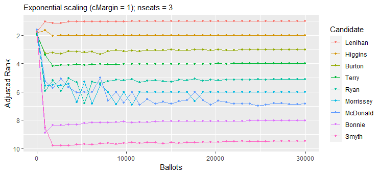

<!-- README.md is generated from README.Rmd. Please edit that file -->

# SafeVote

<!-- badges: start -->
<!-- badges: end -->

The goals of SafeVote are to investigate the safety of announcing
preliminary results from an election, and to allow experimental study of
the safety of a complete ranking of all candidates (as in a party list)
that is derived from a small-scale election with preferential ballots.

## Installation

You can install the development version of SafeVote from
[GitHub](https://github.com/) with:

``` r
# install.packages("devtools")
devtools::install_github("cthombor/SafeVote")
```

## Examples

This mod of
[vote_2.3.2](https://cran.r-project.org/web/packages/vote/index.html)
reports the margins of victory in an election.

The value of the `safety` parameter will affect the completeness of the
safeRank ordering of the candidates. Setting `safety = 0` will cause
safeRank to be a total ranking of the candidates, except in the rare
case that there is an exact tie. The “fuzz” $z$ on the
vote-differentials in a safeRank clustering of the candidates is
$z = s\sqrt{n}$, where $s$ is the value of the safety parameter and $n$
is the number of ballots.

        library(SafeVote)
        data(food_election)
        stv(food_election)
        stv(food_election, safety=0.25)
        stv(food_election, safety=0)

A few safety-testing routines are supplied, to support experimental
study of the statistical behaviour of ballot counting methods. For
example, `testFraction` draws a series of independent samples from a
ballot box, which we expect to be helpful in estimating the number of
ballots required to form a stable result. As seen below, in the case of
the [dublin_west](dublin_west) dataset, only a few thousand ballots are
sufficient to reliably determine the three winners (Lenihan, Higgins,
Burton). By contrast, the relative ranking of Ryan and Morrissey is
still somewhat unstable when the last few thousands of ballots are being
counted.

    data(dublin_west)
    plot(testFraction(dublin_west,astart=34,ainc=881,countArgs=list(nseats=3)))



[testAdditions](testAdditions) can be used to assess the sensitivity of
an STV election to a tactical-voting strategy of “plumping” for a
favoured candidate. For example, we find it takes only two “plumping”
ballots to shift “Strawberries” from third place to second place in the
[food_election](food_election) dataset. Note that in this test we have
set the `safety` parameter of the [stv](stv) ballot-counting method to
zero, so that the output of [testAdditions](testAdditions) reveals a
minimally-safe ranking of the candidates.

    data(food_election) 
    testAdditions(food_election, arep = 2, favoured = "Strawberries", 
      countArgs = list(safety = 0))
    #> 
    #> Adding up to 2 stv ballots = ( 3 5 4 1 2 )
    #> Testing progress:  1, 2
    #> 
    #> Results of testAdditions at 2022-12-26 08:25:22
    #> 
    #> Dataset = food_election, countMethod = stv, rankMethod = safeRank
    #> 
    #> |          | safety|
    #> |:---------|------:|
    #> |countArgs |      0|
    #> 
    #> 
    #> |             | ainc| arep|                                                         tacticalBallot|
    #> |:------------|----:|----:|----------------------------------------------------------------------:|
    #> |otherFactors |    1|    2| c(Oranges = 3, Pears = 5, Chocolate = 4, Strawberries = 1, Sweets = 2)|
    #> 
    #> Experiment ID, number of ballots in simulated election, ranks, winning margins:
    #> 
    #> |exptID | nBallots| Oranges| Pears| Chocolate| Strawberries| Sweets| m.Oranges| m.Pears| m.Chocolate| m.Strawberries|  m.Sweets|
    #> |:------|--------:|-------:|-----:|---------:|------------:|------:|---------:|-------:|-----------:|--------------:|---------:|
    #> |SBK0   |       20|       2|     5|         1|            3|      4| 1.4451111|       2|           8|      1.7774444| 0.7774444|
    #> |SBK1   |       21|       2|     5|         1|            3|      4| 0.6673333|       2|           8|      2.6663333| 0.6663333|
    #> |SBK2   |       22|       3|     5|         1|            2|      4| 3.4447778|       2|           8|      0.1104444| 0.5552222|

[testDeletions](testDeletions) deletes ballots sequentially from the
ballot box, counting after each deletion. When its results are plotted
in inverse order of collection (i.e. in *increasing* order of the number
of ballots $n$) we see a possible evolution of the preliminary results
from an election in which the initial order of ballots in the ballot box
had been randomised. Note that a plot of the results of
[testFraction](testFraction) has quite a similar appearance, however the
ballot boxes counted in [testFraction](testFraction) are independently
sampled (“bootstrapped”) from the full dataset of ballots. By contrast,
[testDeletions](testDeletions) samples without replacement from the
original ballot box, when constructing its next experimental unit.

        
        xr <- testDeletions(dublin_west,dinc=25,dstart=29988,quiet=FALSE,
          countArgs=list(safety=0.0,complete.ranking=TRUE,nseats=3))
        save(xr,file="../s0di25ns3.rdata")
        plot(xr,title="testDeletions, file = s0di25ns3")


