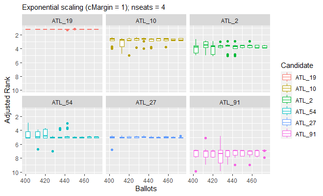
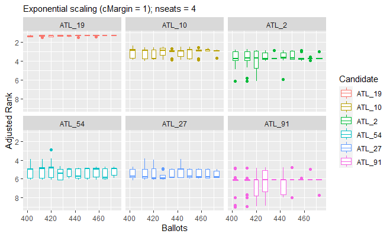

<!-- README.md is generated from README.Rmd. Please edit that file -->

# SafeVote

<!-- badges: start -->
<!-- badges: end -->

The goals of SafeVote are to investigate the safety of announcing
preliminary results from an election, and to allow experimental study of
the safety of a complete ranking of all candidates (as in a party list)
that is derived from a small-scale election with preferential ballots.

## Installation

You can install the development version of SafeVote from
[GitHub](https://github.com/) with:

``` r
# install.packages("devtools")
devtools::install_github("cthombor/SafeVote")
```

## Example

This mod of
[vote.2.3-2](https://cran.r-project.org/web/packages/vote/index.html)
reports the margins of victory in an election.

The value of the `safety` parameter will affect the completeness of the
safeRank ordering of the candidates. Setting `safety = 0` will cause
safeRank to be a total ranking of the candidates, except in the rare
case that there is an exact tie. The “fuzz” $z$ on the
vote-differentials in a safeRank clustering of the candidates is
$z = s\sqrt{n}$, where $s$ is the value of the safety parameter and $n$
is the number of ballots.

``` r
    library(SafeVote)
    data(food_election)
    stv(food_election)
    stv(food_election, safety=0.25)
    stv(food_election, safety=0)
```

A few safety-testing routines are supplied, to support experimental
study of the statistical behaviour of ballot counting methods.

[testFraction](testFraction) draws a series of independent samples from
a ballot box. Stochastic experimentation with this method will, we hope,
help future researchers develop advice, to election officials, on
whether a preliminary count is sufficiently stable for them to make a
preliminary announcement of the result – without undue risk of having to
retract their announcement (as in [Hastings NZ in October
2022](https://www.1news.co.nz/2022/10/12/public-humiliation-council-apologises-for-election-result-error/)).
As seen below, in the case of the [yale_ballots](yale_ballots) dataset,
400 of the 479 votes were sufficient to establish candidates ATL_19,
ATL_10, and ATL_2 as being very likely to be three of the four winners.
The balloting was extremely close for the fourth seat. ATL_54 was the
eventual winner; but ATL_54 and ATL_27 are ranked approximately 5= as
the last 50 ballots are counted. The STV variant used in this experiment
has fractional vote-transfers and a Hare quota.

``` r
load(SaveVote)
xrHare <- 
  testFraction(yale_ballots,arep=9,ainc=5,astart=400,
               countArgs=list(nseats=4,safety=0.0,quota.hare=TRUE))
plot(xrHare,boxPlot=TRUE,boxPlotCutInterval=10,
     line=FALSE,facetWrap=TRUE,nResults=6)
```

 [testFraction](testFraction) may also be
useful in determining the extent to which the safety of the preliminary
results of an STV election is affected by its quota method. In the case
of the 2016 Yale Senate election, the use of a Droop quota seems likely
to have significantly increased the variance in partial results for the
fourth seat. Multiple rounds of elimination were required before any
candidate achieved the quota, increasing the importance of votes
transferred from the eliminated candidates. Furthermore, the \[Cambridge
method of transferring
votes(<https://www.opavote.com/methods/cambridge-stv-rules>) may have
been employed. Under these rules, the initial numbering of the ballots
determines the ballot papers which are consulted when a candidate’s
surplus votes are transfered. As noted in the tests of [STV
v1.0.2](https://cran.r-project.org/package=STV), if ballots are selected
for a vote-transfer process are determined by a pseudorandom number
generator, the seeding of this generator affects the outcome of the
election. The median bars in the per-candidate boxplots in the last
decile of vote-counting in our experimental results below (using the
Droop quota with fractional vote transfers), ATL_2 has a small margin of
victory for the third seat, ATL_54 has a small margin of victory for the
fourth seat, and ATL_27 is not elected.

``` r
load(SaveVote)
xrDroop <- 
  testFraction(yale_ballots,arep=9,ainc=5,astart=400,
               countArgs=list(nseats=4,safety=0.0,quota.hare=FALSE))
plot(xrDroop,boxPlot=TRUE,boxPlotCutInterval=10,
     line=FALSE,facetWrap=TRUE,nResults=6)
```



[testAdditions](testAdditions) can be used to assess the sensitivity of
an STV election to a tactical-voting strategy of “plumping” for a
favoured candidate. For example, we find it takes only two “plumping”
ballots to shift “Strawberries” from third place to second place in the
[food_election](food_election) dataset. Note that in this test we have
set the `safety` parameter of the [stv](stv) ballot-counting method to
zero, so that the output of [testAdditions](testAdditions) reveals a
complete ranking of the candidates unless there is an exact tie.

``` r
load(SaveVote)
testAdditions(food_election, arep = 2, favoured = "Strawberries", 
  countArgs = list(safety = 0))
#> 
#> Adding up to 2 stv ballots = ( 3 5 4 1 2 )
#> Testing progress:  1, 2
#> 
#> Results of testAdditions at 2022-12-26 08:25:22
#> 
#> Dataset = food_election, countMethod = stv, rankMethod = safeRank
#> 
#> |          | safety|
#> |:---------|------:|
#> |countArgs |      0|
#> 
#> 
#> |             | ainc| arep|                                                         tacticalBallot|
#> |:------------|----:|----:|----------------------------------------------------------------------:|
#> |otherFactors |    1|    2| c(Oranges = 3, Pears = 5, Chocolate = 4, Strawberries = 1, Sweets = 2)|
#> 
#> Experiment ID, number of ballots in simulated election, ranks, winning margins:
#> 
#> |exptID | nBallots| Oranges| Pears| Chocolate| Strawberries| Sweets| m.Oranges| m.Pears| m.Chocolate| m.Strawberries|  m.Sweets|
#> |:------|--------:|-------:|-----:|---------:|------------:|------:|---------:|-------:|-----------:|--------------:|---------:|
#> |SBK0   |       20|       2|     5|         1|            3|      4| 1.4451111|       2|           8|      1.7774444| 0.7774444|
#> |SBK1   |       21|       2|     5|         1|            3|      4| 0.6673333|       2|           8|      2.6663333| 0.6663333|
#> |SBK2   |       22|       3|     5|         1|            2|      4| 3.4447778|       2|           8|      0.1104444| 0.5552222|
```

[testDeletions](testDeletions) deletes ballots sequentially from the
ballot box, counting after each deletion. When its results are plotted
in inverse order of collection (i.e. in *increasing* order of the number
of ballots $n$) we see one possible evolution of the preliminary results
of an election in which ballots are counted in a randomised order
(without replacement) from the ballot box. Note that a plot of the
results of [testFraction](testFraction) has a similar appearance,
however the ballot boxes counted in [testFraction](testFraction) are
independently sampled (“bootstrapped”) from the full dataset of ballots.

``` r
load(SaveVote)
xr <- 
  testDeletions(dublin_west,dinc=25,dstart=29988,quiet=FALSE,
                countArgs=list(safety=0.0,nseats=3))
save(xr,file="../s0di25ns3.rdata")
plot(xr,title="testDeletions, file = s0di25ns3")
```


In the plots above, the “adjusted rank” of a candidate is their ranking
$r$ plus their scaled margin of victory. Following the usual convention,
the most-popular candidate is at rank 1. Accordingly, we invert the
$y$-axis so that the rank-1 candidate is visually dominant. Our default
scaling of a margin of victory $m$ is $e^{-cm/\sqrt{n}}$. This
exponential scaling makes it possible to see small differences in
vote-counts in the small margins of victory which affect the safety of
an election result. We introduce the scaling factor $c/\sqrt{n}$ into
the exponent as a rough-cut estimate of the standard deviation of the
standard deviation of a victory margin in an election with $n$ ballots.
Our margin-scaling parameter $c$ has the default value of 1, and may be
adjusted using the parameter `cMargin` of
[plot.SafeVote](plot.SafeVote). In the sample
[testDeletions](testDeletions) plot above, Morrissey’s adjusted rank is
visually very close to McDonald’s adjusted rank when most of the ballots
have been counted. This suggests to us that their relative standing in
this election is sensitive to small variations in voter behaviour.

One of our primary motivations for developing this package was its
possible future use in ranking candidates for the party list of the
Green Party of Aotearoa New Zealand. To date, we have found no academic
study of methods for ranking candidates using preferential-voting
ballots, making it quite possibly a greenfield problem in social-choice
research. In private communication of November 2022, Prof. Nicolaus
Tideman had offered some advice on our initial proposal for ranking with
a Condorcet score. However, because diversity is one of the explicit
[values](https://www.greens.org.nz/our_values) of this party, a ranking
that is derived from an STV-style ballot-counting process would seem
much more appropriate for use by the NZ Greens than any ranking that is
derived from a Condorcet scoring process. Indeed, the NZ Greens are
currently using a modification of Meek’s STV algorithm, enshrined in
[Schedule 1A of Local Electoral Regulations
2001](https://www.legislation.govt.nz/regulation/public/2001/0145/latest/DLM57125.html),
to form its party list. Under its current rules, the NZ Greens rely on a
delegated assembly to form an [initial
list](https://www.stuff.co.nz/national/politics/120950431/green-party-initial-election-list-puts-newcomer-teanau-tuiono-ahead-of-several-sitting-mps).
In a possible future in which the NZ Greens have dozens of elected MPs,
the size of this assembly may have to be increased if the sitting MPs
seeking re-election are to be safely ranked against each other, and
against other candidates in the pool. We wonder: are $n$ preferential
ballots sufficient to safely rank-order $\sqrt{n}$ candidates? This
package is, we hope, a first step toward answering this question.
