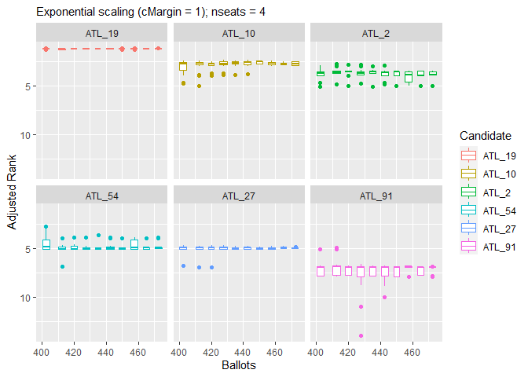
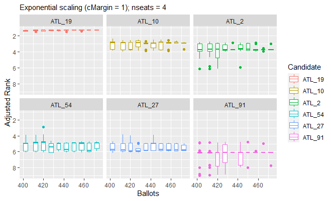
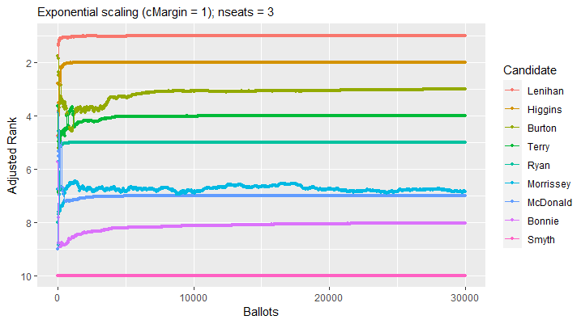

<!-- README.md is generated from README.Rmd. Please edit that file -->

# SafeVote

<!-- badges: start -->

<!-- badges: end -->

The goals of SafeVote are to investigate the safety of announcing
preliminary results from an election, and to allow experimental study of
the safety of a complete ranking of all candidates (as in a party list)
that is derived from a small-scale election with preferential ballots.

## Installation

You can install the development version of SafeVote from
[GitHub](https://github.com/) with:

``` r
# install.packages("devtools")
devtools::install_github("cthombor/SafeVote")
```

## Example

This mod of [vote.2.3-2](https://CRAN.R-project.org/package=vote)
reports the margins of victory in an election.

The value of the `safety` parameter will affect the completeness of the
safeRank ordering of the candidates. Setting `safety = 0` will cause
safeRank to be a total ranking of the candidates, except in the rare
case that there is an exact tie. The “fuzz” $z$ on the
vote-differentials in a safeRank clustering of the candidates is
$z = s\sqrt{n}$, where $s$ is the value of the safety parameter and $n$
is the number of ballots.

``` r
library(SafeVote)
stv(food_election,quiet=TRUE)$rankingTable
#>   Rank    Margin    Candidate Elected SafeRank
#> 1    1 8.0000000    Chocolate       x        1
#> 2    2 0.5548889 Strawberries       x        2
#> 3    3 1.2225556      Oranges                2
#> 4    4 0.7774444       Sweets                2
#> 5    5        NA        Pears                2
stv(food_election,quiet=TRUE,safety=0)$rankingTable
#>   Rank    Margin    Candidate Elected SafeRank
#> 1    1 8.0000000    Chocolate       x        1
#> 2    2 0.5548889 Strawberries       x        2
#> 3    3 1.2225556      Oranges                3
#> 4    4 0.7774444       Sweets                4
#> 5    5        NA        Pears                5
```

Three safety-testing routines are supplied, to support experimental
study of the stochastic behaviour of ballot counting methods.

## testFraction

[testFraction](#testfraction) draws a series of independent samples from
a ballot box. Stochastic experimentation with this method will, we hope,
help future researchers develop advice, to election officials, on
whether a preliminary count is sufficiently stable for them to make a
preliminary announcement of the result – without undue risk of having to
retract their announcement as had occurred in [Hastings NZ in October
2022](http://web.archive.org/web/20230000000000*/www.1news.co.nz/2022/10/12/public-humiliation-council-apologises-for-election-result-error/).
As seen below, in the case of the
[yale_ballots](https://cthombor.github.io/SafeVote/reference/yale_ballots)
dataset, 400 of the 479 votes were sufficient to establish candidates
ATL_19, ATL_10, and ATL_2 as being very likely to be three of the four
winners. The balloting was extremely close for the fourth seat. ATL_54
was the eventual winner; but ATL_54 and ATL_27 are ranked approximately
5= as the last 50 ballots are counted. The STV variant used in this
experiment has fractional vote-transfers and a Hare quota.

``` r
library(SafeVote)
xrHare <- testFraction(yale_ballots,arep=9,ainc=5,astart=400,
               countArgs=list(nseats=4,safety=0.0,quota.hare=TRUE))
#> Progress in counting stv ballots:
#>  0.7%, 1.4%, 2.1%, 2.8%, 3.5%, 4.2%, 4.9%, 5.6%, 6.2%, 6.9%,
#>  7.6%, 8.3%, 9%, 9.7%, 10.4%, 11.1%, 11.8%, 12.5%, 13.2%, 13.9%,
#>  14.6%, 15.3%, 16%, 16.7%, 17.4%, 18.1%, 18.8%, 19.4%, 20.1%, 20.8%,
#>  21.5%, 22.2%, 22.9%, 23.6%, 24.3%, 25%, 25.7%, 26.4%, 27.1%, 27.8%,
#>  28.5%, 29.2%, 29.9%, 30.6%, 31.2%, 31.9%, 32.6%, 33.3%, 34%, 34.7%,
#>  35.4%, 36.1%, 36.8%, 37.5%, 38.2%, 38.9%, 39.6%, 40.3%, 41%, 41.7%,
#>  42.4%, 43.1%, 43.8%, 44.4%, 45.1%, 45.8%, 46.5%, 47.2%, 47.9%, 48.6%,
#>  49.3%, 50%, 50.7%, 51.4%, 52.1%, 52.8%, 53.5%, 54.2%, 54.9%, 55.6%,
#>  56.2%, 56.9%, 57.6%, 58.3%, 59%, 59.7%, 60.4%, 61.1%, 61.8%, 62.5%,
#>  63.2%, 63.9%, 64.6%, 65.3%, 66%, 66.7%, 67.4%, 68.1%, 68.8%, 69.4%,
#>  70.1%, 70.8%, 71.5%, 72.2%, 72.9%, 73.6%, 74.3%, 75%, 75.7%, 76.4%,
#>  77.1%, 77.8%, 78.5%, 79.2%, 79.9%, 80.6%, 81.2%, 81.9%, 82.6%, 83.3%,
#>  84%, 84.7%, 85.4%, 86.1%, 86.8%, 87.5%, 88.2%, 88.9%, 89.6%, 90.3%,
#>  91%, 91.7%, 92.4%, 93.1%, 93.8%, 94.4%, 95.1%, 95.8%, 96.5%, 97.2%,
#>  97.9%, 98.6%, 99.3%, 100%
#> 
#> Results of testFraction at 2026-03-23 11:33:41
#> 
#> Dataset = yale_ballots, countMethod = stv, rankMethod = safeRank
#> 
#> |          | nseats| safety| quota.hare|
#> |:---------|------:|------:|----------:|
#> |countArgs |      4|      0|       TRUE|
#> 
#> 
#> |             | astart| ainc| arep|
#> |:------------|------:|----:|----:|
#> |otherFactors |    400|    5|    9|
#> 
#> Experiment ID, number of ballots in simulated election, ranks, winning margins:
#> 
#> |exptID | nBallots| ATL_16| ATL_27| ATL_14| ATL_54| ATL_87| ATL_1| ATL_26| ATL_29| ATL_6| ATL_25| ATL_93| ATL_30| ATL_88| ATL_21| ATL_10| ATL_34| ATL_7| ATL_13| ATL_9| ATL_2| ATL_11| ATL_36| ATL_31| ATL_126| ATL_18| ATL_89| ATL_19| ATL_5| ATL_90| ATL_17| ATL_32| ATL_91| ATL_23| ATL_15| ATL_28| ATL_33| ATL_3| ATL_92| ATL_4| ATL_22| ATL_8| ATL_24| ATL_35| ATL_20| m.ATL_16|  m.ATL_27| m.ATL_14|   m.ATL_54| m.ATL_87| m.ATL_1| m.ATL_26| m.ATL_29| m.ATL_6| m.ATL_25| m.ATL_93| m.ATL_30| m.ATL_88| m.ATL_21|   m.ATL_10| m.ATL_34| m.ATL_7| m.ATL_13| m.ATL_9|    m.ATL_2| m.ATL_11| m.ATL_36| m.ATL_31| m.ATL_126| m.ATL_18| m.ATL_89| m.ATL_19| m.ATL_5| m.ATL_90| m.ATL_17| m.ATL_32| m.ATL_91| m.ATL_23| m.ATL_15| m.ATL_28| m.ATL_33| m.ATL_3| m.ATL_92| m.ATL_4| m.ATL_22| m.ATL_8| m.ATL_24| m.ATL_35| m.ATL_20|
#> |:------|--------:|------:|------:|------:|------:|------:|-----:|------:|------:|-----:|------:|------:|------:|------:|------:|------:|------:|-----:|------:|-----:|-----:|------:|------:|------:|-------:|------:|------:|------:|-----:|------:|------:|------:|------:|------:|------:|------:|------:|-----:|------:|-----:|------:|-----:|------:|------:|------:|--------:|---------:|--------:|----------:|--------:|-------:|--------:|--------:|-------:|--------:|--------:|--------:|--------:|--------:|----------:|--------:|-------:|--------:|-------:|----------:|--------:|--------:|--------:|---------:|--------:|--------:|--------:|-------:|--------:|--------:|--------:|--------:|--------:|--------:|--------:|--------:|-------:|--------:|-------:|--------:|-------:|--------:|--------:|--------:|
#> |FDC1   |      400|     17|      4|     31|      5|     28|    18|     23|     15|     6|      8|     12|     37|     25|     36|      2|     30|    13|     29|    32|     3|     27|     19|     11|      22|     20|     38|      1|    26|     40|     16|     14|      7|     21|     42|     33|     34|    10|     39|    44|     24|    35|     41|     43|      9|        1|  3.156602|        1| 44.6264096|        1|       0|        1|        0|       1|        4|        0|        0|        1|        0| 13.3915060|        0|       2|        0|       0| 12.0122872|        0|        0|        1|         1|        1|        0|       33|       0|        1|        1|        1|        3|        0|        0|        0|        0|       2|        0|       0|        1|       1|        0|        1|        0|
#> |FDC2   |      405|     19|      4|     26|      5|     34|    18|     22|     17|     6|      8|     15|     30|     31|     41|      2|     20|     9|     27|    33|     3|     25|     24|     13|      37|     23|     32|      1|    29|     36|     16|     14|      7|     21|     42|     40|     28|    11|     35|    43|     12|    38|     39|     44|     10|        0|  8.078289|        0| 45.3131566|        0|       0|        1|        0|       0|        0|        0|        1|        0|        0| 11.1174337|        0|       2|        0|       0|  9.9993775|        1|        1|        1|         1|        0|        1|       30|       0|        0|        1|        1|        9|        1|        1|        1|        0|       1|        0|       0|        0|       0|        0|        0|        0|
#> |FDC3   |      410|     18|      4|     36|      5|     20|    22|     24|     15|     6|      8|     12|     38|     31|     39|      2|     19|    13|     26|    27|     3|     40|     25|     11|      32|     23|     33|      1|    30|     34|     21|     16|      7|     14|     41|     28|     29|     9|     35|    44|     17|    37|     42|     43|     10|        1|  7.215483|        1| 46.5027931|        1|       1|        0|        1|       1|        5|        0|        0|        1|        0| 11.4309655|        0|       0|        0|       1|  9.9830416|        1|        1|        2|         0|        2|        0|       35|       0|        0|        0|        1|        3|        1|        1|        0|        0|       0|        0|       0|        0|       0|        0|        1|        2|
#> |FDC4   |      415|     14|      4|     27|      5|     28|    21|     19|     15|     7|      9|     16|     39|     32|     34|      2|     26|    13|     30|    33|     3|     24|     18|     12|      25|     23|     31|      1|    29|     41|     17|     10|      6|     22|     44|     37|     36|     8|     35|    43|     20|    38|     40|     42|     11|        1|  8.619522|        0| 46.2390435|        1|       0|        1|        2|       3|        4|        1|        0|        1|        0| 15.4646413|        0|       3|        0|       0|  9.7883424|        0|        1|        1|         1|        0|        0|       30|       1|        1|        0|        1|        2|        1|        0|        1|        0|       1|        0|       0|        1|       0|        0|        1|        0|
#> |FDC5   |      420|     18|      5|     27|      4|     38|    19|     22|     13|     7|      8|     12|     28|     34|     35|      2|     29|    14|     25|    30|     3|     26|     21|     10|      23|     24|     33|      1|    31|     41|     20|     15|      6|     16|     44|     37|     36|     9|     32|    43|     17|    39|     40|     42|     11|        1| 52.524337|        0|  0.4456957|        1|       1|        0|        0|       1|        2|        1|        1|        0|        0|  2.8614239|        0|       0|        0|       0|  3.1419404|        1|        1|        3|         1|        1|        1|       30|       1|        1|        0|        2|        1|        1|        0|        0|        0|       2|        0|       0|        0|       0|        0|        1|        2|
#> |FDC6   |      425|     18|      4|     33|      5|     21|    23|     20|     15|     6|      8|     14|     34|     36|     40|      2|     19|    12|     25|    35|     3|     29|     24|     10|      30|     28|     27|      1|    26|     38|     17|     13|      7|     22|     42|     37|     32|     9|     31|    44|     16|    39|     41|     43|     11|        2|  0.088200|        0| 52.2058000|        1|       1|        0|        1|       1|        2|        1|        0|        0|        1|  7.0882000|        1|       2|        0|       0| 15.9807102|        0|        1|        1|         1|        0|        0|       33|       1|        1|        0|        3|        1|        0|        0|        0|        0|       2|        0|       0|        0|       0|        0|        1|        2|
#> |FDC7   |      430|     16|      4|     29|      5|     26|    18|     23|     17|     7|      8|     14|     32|     30|     39|      2|     20|    12|     27|    34|     3|     24|     25|     11|      35|     21|     31|      1|    28|     37|     22|     13|      6|     15|     44|     33|     40|     9|     36|    43|     19|    38|     42|     41|     10|        1|  1.224663|        0| 52.2695955|        2|       0|        0|        2|       2|        1|        2|        0|        0|        0| 13.1797303|        1|       0|        0|       0|  9.1745989|        0|        0|        3|         0|        1|        0|       30|       1|        1|        0|        1|        2|        0|        0|        1|        1|       3|        0|       0|        0|       0|        1|        0|        1|
#> |FDC8   |      435|     17|      5|     28|      3|     21|    20|     19|     15|     6|      8|     14|     30|     29|     35|      2|     23|    12|     27|    31|     4|     25|     26|     10|      36|     24|     39|      1|    34|     38|     22|     13|      7|     16|     42|     32|     33|     9|     37|    44|     18|    41|     40|     43|     11|        1| 54.736716|        1|  0.7020800|        1|       0|        0|        0|       3|        2|        1|        1|        0|        0|  0.2894526|        2|       1|        0|       0|  2.1316421|        0|        1|        1|         0|        1|        0|       34|       1|        1|        0|        1|        2|        1|        0|        0|        0|       2|        0|       0|        2|       0|        1|        2|        3|
#> |FDC9   |      440|     17|      5|     27|      4|     28|    19|     21|     16|     7|      8|     13|     35|     31|     36|      2|     23|    12|     26|    32|     3|     25|     33|     10|      22|     24|     30|      1|    29|     38|     15|     14|      6|     20|     42|     37|     41|     9|     34|    44|     18|    39|     40|     43|     11|        2| 52.422956|        0|  0.8461978|        1|       0|        0|        0|       2|        4|        0|        1|        1|        0|  9.0769011|        1|       2|        2|       0|  1.3340464|        0|        0|        2|         1|        0|        0|       28|       0|        1|        1|        2|        4|        1|        1|        0|        1|       1|        0|       0|        0|       0|        0|        1|        2|
#> |FDC10  |      445|     21|      5|     27|      4|     18|    19|     20|     15|     7|      8|     13|     36|     31|     38|      2|     23|    12|     26|    37|     3|     29|     28|     11|      25|     24|     30|      1|    32|     42|     16|     14|      6|     22|     43|     35|     34|     9|     33|    44|     17|    39|     40|     41|     10|        0| 51.459098|        0|  5.7527935|        1|       1|        0|        3|       1|        3|        0|        1|        0|        1|  3.9646848|        1|       2|        0|       0|  0.2698573|        0|        1|        3|         2|        0|        0|       31|       0|        0|        1|        1|        3|        0|        1|        0|        0|       1|        0|       0|        0|       0|        1|        0|        2|
#> ...
#> 
#> 
#> |    |exptID | nBallots| ATL_16| ATL_27| ATL_14| ATL_54| ATL_87| ATL_1| ATL_26| ATL_29| ATL_6| ATL_25| ATL_93| ATL_30| ATL_88| ATL_21| ATL_10| ATL_34| ATL_7| ATL_13| ATL_9| ATL_2| ATL_11| ATL_36| ATL_31| ATL_126| ATL_18| ATL_89| ATL_19| ATL_5| ATL_90| ATL_17| ATL_32| ATL_91| ATL_23| ATL_15| ATL_28| ATL_33| ATL_3| ATL_92| ATL_4| ATL_22| ATL_8| ATL_24| ATL_35| ATL_20| m.ATL_16|  m.ATL_27| m.ATL_14|   m.ATL_54| m.ATL_87| m.ATL_1| m.ATL_26| m.ATL_29| m.ATL_6| m.ATL_25| m.ATL_93| m.ATL_30| m.ATL_88| m.ATL_21|   m.ATL_10| m.ATL_34| m.ATL_7| m.ATL_13| m.ATL_9|   m.ATL_2| m.ATL_11| m.ATL_36| m.ATL_31| m.ATL_126| m.ATL_18| m.ATL_89| m.ATL_19| m.ATL_5| m.ATL_90| m.ATL_17| m.ATL_32| m.ATL_91| m.ATL_23| m.ATL_15| m.ATL_28| m.ATL_33| m.ATL_3| m.ATL_92| m.ATL_4| m.ATL_22| m.ATL_8| m.ATL_24| m.ATL_35| m.ATL_20|
#> |:---|:------|--------:|------:|------:|------:|------:|------:|-----:|------:|------:|-----:|------:|------:|------:|------:|------:|------:|------:|-----:|------:|-----:|-----:|------:|------:|------:|-------:|------:|------:|------:|-----:|------:|------:|------:|------:|------:|------:|------:|------:|-----:|------:|-----:|------:|-----:|------:|------:|------:|--------:|---------:|--------:|----------:|--------:|-------:|--------:|--------:|-------:|--------:|--------:|--------:|--------:|--------:|----------:|--------:|-------:|--------:|-------:|---------:|--------:|--------:|--------:|---------:|--------:|--------:|--------:|-------:|--------:|--------:|--------:|--------:|--------:|--------:|--------:|--------:|-------:|--------:|-------:|--------:|-------:|--------:|--------:|--------:|
#> |135 |FDC135 |      430|     21|      4|     33|      5|     34|    19|     20|     13|     6|      7|     12|     40|     29|     41|      2|     17|    14|     25|    36|     3|     27|     26|     11|      22|     24|     28|      1|    35|     37|     16|     15|      8|     23|     43|     32|     31|     9|     30|    44|     18|    38|     39|     42|     10|        0|  6.274161|        0| 48.8224839|        0|       1|        1|        0|       6|        1|        2|        0|        0|        0| 18.5483226|        1|       0|        0|       0|  7.258777|        0|        2|        4|         0|        1|        0|       37|       1|        1|        0|        4|        2|        1|        1|        0|        0|       2|        0|       0|        0|       0|        1|        0|        0|
#> |136 |FDC136 |      435|     17|      4|     29|      5|     34|    20|     22|     14|     7|      8|     13|     39|     40|     35|      2|     25|    12|     23|    28|     3|     26|     18|     11|      36|     24|     30|      1|    27|     37|     16|     15|      6|     21|     43|     32|     33|     9|     31|    44|     19|    38|     41|     42|     10|        0|  2.326846|        0| 53.2334615|        1|       0|        2|        0|       2|        2|        1|        0|        0|        0| 14.0933846|        0|       2|        1|       0|  7.971005|        1|        2|        1|         0|        0|        1|       33|       0|        1|        1|        1|        5|        1|        1|        0|        0|       1|        0|       0|        0|       0|        1|        1|        3|
#> |137 |FDC137 |      440|     15|      5|     31|      4|     32|    18|     21|     16|     7|      9|     13|     38|     30|     35|      3|     17|    12|     23|    34|     2|     27|     26|     10|      22|     24|     29|      1|    28|     40|     19|     14|      6|     25|     43|     37|     33|     8|     36|    44|     20|    41|     39|     42|     11|        2| 52.269528|        0|  2.8652360|        1|       0|        1|        2|       1|        1|        0|        0|        0|        0|  0.2423236|        1|       1|        0|       0|  3.000000|        0|        0|        2|         1|        1|        0|       30|       1|        1|        1|        1|        7|        0|        1|        1|        1|       1|        0|       0|        1|       0|        0|        0|        3|
#> |138 |FDC138 |      445|     19|      5|     30|      4|     26|    22|     21|     14|     7|      8|     13|     35|     31|     40|      2|     25|    12|     29|    32|     3|     23|     18|     11|      28|     24|     36|      1|    27|     38|     16|     15|      6|     20|     43|     37|     34|     9|     33|    44|     17|    39|     41|     42|     10|        0| 53.084157|        0|  1.9747528|        1|       1|        0|        0|       2|        1|        2|        0|        1|        0|  3.0084157|        0|       1|        0|       0|  3.175066|        1|        1|        1|         1|        0|        0|       27|       0|        1|        1|        1|        3|        1|        1|        0|        0|       2|        0|       0|        1|       0|        1|        0|        3|
#> |139 |FDC139 |      450|     20|      5|     28|      3|     21|    18|     22|     15|     7|      8|     14|     34|     38|     39|      2|     19|    11|     27|    30|     4|     25|     26|     12|      40|     24|     29|      1|    36|     35|     17|     13|      6|     23|     43|     32|     33|     9|     31|    44|     16|    37|     41|     42|     10|        0| 53.180411|        1|  0.9119900|        1|       1|        0|        1|       5|        1|        2|        1|        0|        0|  7.0000000|        1|       0|        0|       0|  3.902856|        0|        1|        1|         0|        0|        1|       26|       1|        0|        1|        1|        0|        1|        2|        0|        0|       1|        0|       0|        1|       0|        1|        0|        3|
#> |140 |FDC140 |      455|     17|      4|     27|      5|     29|    18|     21|     15|     6|      8|     13|     40|     31|     35|      2|     19|    12|     30|    34|     3|     26|     25|     11|      23|     24|     37|      1|    28|     38|     16|     14|      7|     22|     42|     32|     33|     9|     36|    44|     20|    39|     41|     43|     10|        1|  6.122250|        0| 53.3667500|        1|       0|        0|        1|       1|        0|        2|        0|        0|        0| 17.1630000|        0|       2|        1|       0|  6.383546|        1|        0|        3|         1|        0|        0|       34|       0|        1|        0|        1|        3|        0|        0|        0|        1|       2|        0|       0|        1|       0|        1|        1|        0|
#> |141 |FDC141 |      460|     17|      5|     28|      4|     24|    19|     22|     13|     7|      8|     12|     37|     32|     38|      3|     30|    11|     27|    33|     2|     25|     21|     15|      26|     23|     31|      1|    29|     39|     16|     14|      6|     20|     43|     35|     36|     9|     34|    44|     18|    40|     41|     42|     10|        1| 56.507677|        0|  0.7656875|        1|       0|        2|        0|       6|        1|        0|        1|        1|        0|  3.1437912|        0|       4|        0|       0|  0.000000|        0|        1|        0|         1|        0|        0|       35|       1|        1|        0|        0|        1|        0|        1|        0|        0|       3|        0|       0|        1|       0|        1|        0|        1|
#> |142 |FDC142 |      465|     18|      5|     28|      4|     36|    21|     20|     14|     7|      8|     15|     37|     30|     38|      2|     19|    12|     27|    32|     3|     25|     26|     11|      23|     24|     29|      1|    31|     40|     16|     13|      6|     22|     43|     34|     35|     9|     33|    44|     17|    39|     41|     42|     10|        0| 56.569454|        1|  0.7371753|        0|       0|        0|        0|       2|        0|        2|        1|        0|        1|  1.0000000|        1|       3|        1|       0|  3.095380|        0|        0|        2|         1|        1|        0|       34|       1|        0|        2|        2|        4|        0|        1|        0|        0|       4|        0|       0|        0|       0|        1|        0|        0|
#> |143 |FDC143 |      470|     19|      5|     28|      4|     23|    18|     20|     15|     6|      9|     13|     32|     31|     37|      3|     22|    12|     27|    33|     2|     25|     26|     11|      38|     24|     30|      1|    29|     39|     16|     14|      7|     21|     43|     35|     36|     8|     34|    44|     17|    40|     41|     42|     10|        1| 56.857020|        0|  0.7857449|        1|       0|        0|        1|       1|        3|        0|        1|        0|        0|  4.2910954|        1|       1|        0|       0|  1.785745|        1|        1|        4|         0|        1|        0|       41|       1|        1|        1|        3|        8|        0|        1|        0|        1|       1|        0|       0|        2|       0|        1|        0|        1|
#> |144 |FDC144 |      475|     19|      4|     29|      5|     25|    18|     20|     15|     7|      8|     13|     36|     37|     38|      2|     28|    12|     27|    31|     3|     24|     22|     11|      26|     23|     32|      1|    30|     39|     17|     14|      6|     21|     43|     34|     35|     9|     33|    44|     16|    40|     41|     42|     10|        1|  1.214225|        0| 57.2499286|        0|       0|        0|        3|       4|        0|        0|        1|        0|        0| 15.1428163|        0|       4|        0|       0| 13.631448|        0|        3|        2|         1|        0|        1|       32|       1|        1|        2|        1|        1|        0|        1|        0|        0|       4|        0|       0|        0|       0|        1|        0|        0|
plot(xrHare,boxPlot=TRUE,boxPlotCutInterval=10,
    line=FALSE,facetWrap=TRUE,nResults=6)
#> Warning: Orientation is not uniquely specified when both the x and y aesthetics are
#> continuous. Picking default orientation 'x'.
```



We think `testFraction` would help researchers discover whether the
safety of the preliminary results of an STV election is significantly
affected by its quota method. Anecdotally this seems to be the case. For
example, in the case of the 2016 Yale Senate election plotted above, the
use of a Droop quota rather than a Hare quota would decrease the
uncertainty of the decision for the fourth seat as the count nears
completion. After nearly all ballots are counted, ATL_54 is clearly
leading ATL_27 if the Droop quota is employed. See below.

``` r
load(SaveVote)
xrDroop <- 
  testFraction(yale_ballots,arep=9,ainc=5,astart=400,
               countArgs=list(nseats=4,safety=0.0,quota.hare=FALSE))
plot(xrDroop,boxPlot=TRUE,boxPlotCutInterval=10,
     line=FALSE,facetWrap=TRUE,nResults=6)
```



On theoretical grounds, it seems plausible that the use of a Droop quota
rather than a Hare quota will reduce the fluctuations in ranking as more
ballots are counted. The Droop quota is smaller than the Hare quota, so
the candidates in a close race will be elected in an earlier round. It
seems likely that the count will then be completed with fewer
vote-transfers and perhaps also with less “quasi-chaos”
\[@geller2005single\].

We conjecture that the [Cambridge method of transferring
votes](https://www.opavote.com/methods/cambridge-stv-rules) will
decrease the safety of a count, because its transfer of entire ballots
(rather than fractions of ballots) seems very likely to increase the
variance in the results as additional ballots are counted.

We suggest that an election count might be considered unsafe – for
purposes of declaring a preliminary result after a fraction of ballots
is counted – if its results show significant variance when a random
sample of size $n-\sqrt{n}$ of the $n$ ballots is counted. However we
leave this determination to future researchers, because we believe
safety is only one of many considerations to be considered when
designing and administering an STV election process.

## testAdditions

[testAdditions](https://cthombor.github.io/SafeVote/reference/testAdditions)
can be used to assess the sensitivity of an STV election to a
tactical-voting strategy of “plumping” for a favoured candidate. For
example, we find it takes only two “plumping” ballots to shift
“Strawberries” from third place to second place in the
[food_election](https://cthombor.github.io/SafeVote/reference/food_election)
dataset. Note that in this test we have set the `safety` parameter of
the [stv](https://cthombor.github.io/SafeVote/reference/stv)
ballot-counting method to zero, so that the output of
[testAdditions](https://cthombor.github.io/SafeVote/reference/testAdditions)
reveals a complete ranking of the candidates unless there is an exact
tie.

``` r
load(SaveVote)
testAdditions(food_election, arep = 2, favoured = "Strawberries", 
  countArgs = list(safety = 0))
#> 
#> Adding up to 2 stv ballots = ( 3 5 4 1 2 )
#> Testing progress:  1, 2
#> 
#> Results of testAdditions at 2022-12-26 08:25:22
#> 
#> Dataset = food_election, countMethod = stv, rankMethod = safeRank
#> 
#> |          | safety|
#> |:---------|------:|
#> |countArgs |      0|
#> 
#> 
#> |             | ainc| arep|                                                         tacticalBallot|
#> |:------------|----:|----:|----------------------------------------------------------------------:|
#> |otherFactors |    1|    2| c(Oranges = 3, Pears = 5, Chocolate = 4, Strawberries = 1, Sweets = 2)|
#> 
#> Experiment ID, number of ballots in simulated election, ranks, winning margins:
#> 
#> |exptID | nBallots| Oranges| Pears| Chocolate| Strawberries| Sweets| m.Oranges| m.Pears| m.Chocolate| m.Strawberries|  m.Sweets|
#> |:------|--------:|-------:|-----:|---------:|------------:|------:|---------:|-------:|-----------:|--------------:|---------:|
#> |SBK0   |       20|       2|     5|         1|            3|      4| 1.4451111|       2|           8|      1.7774444| 0.7774444|
#> |SBK1   |       21|       2|     5|         1|            3|      4| 0.6673333|       2|           8|      2.6663333| 0.6663333|
#> |SBK2   |       22|       3|     5|         1|            2|      4| 3.4447778|       2|           8|      0.1104444| 0.5552222|
```

## testDeletions

[testDeletions](https://cthombor.github.io/SafeVote/reference/testDeletions)
deletes ballots sequentially from the ballot box, counting after each
deletion. When its results are plotted in inverse order of collection
(i.e. in *increasing* order of the number of ballots $n$) we see one
possible evolution of the preliminary results of an election in which
ballots are counted in a randomised order (without replacement) from the
ballot box. Note that a plot of the results of
[testFraction](https://cthombor.github.io/SafeVote/reference/testFraction)
has a similar appearance, however the ballot boxes counted in
[testFraction](https://cthombor.github.io/SafeVote/reference/testFraction)
are independently sampled (“bootstrapped”) from the full dataset of
ballots.

``` r
load(SaveVote)
xr <- 
  testDeletions(dublin_west,dinc=25,dstart=29988,quiet=FALSE,
                countArgs=list(safety=0.0,nseats=3))
save(xr,file="../s0di25ns3.rdata")
plot(xr,title="testDeletions, file = s0di25ns3")
```



In the plots above, the “adjusted rank” of a candidate is their ranking
$r$ plus their scaled margin of victory. Following the usual convention,
the most-popular candidate is at rank 1. Accordingly, we invert the
$y$-axis so that the rank-1 candidate is visually dominant. Our default
scaling of a margin of victory $m$ is $e^{-cm/\sqrt{n}}$. This
exponential scaling makes it possible to see small differences in
vote-counts in the small margins of victory which affect the safety of
an election result. Note that a very small margin of victory adds almost
a whole unit to the candidate’s rank. We introduce the scaling factor
$c/\sqrt{n}$ into the exponent as a rough-cut estimate of the standard
deviation of the standard deviation of a victory margin in an election
with $n$ ballots. A candidate whose margin of victory is a multiple of
$\sqrt{n}$ thus has a very small adjustment to their rank in our plots.
Our margin-scaling parameter $c$ has the default value of 1, and may be
adjusted using the parameter `cMargin` of
[plot.SafeVote](https://cthombor.github.io/SafeVote/reference/plot.SafeVote.stv).

In the sample
[testDeletions](https://cthombor.github.io/SafeVote/reference/testDeletions)
plot above, Morrissey’s adjusted rank is visually very close to
McDonald’s adjusted rank when most of the ballots have been counted.
This suggests to us that their relative standing in this election is
sensitive to small variations in voter behaviour.

One of our primary motivations for developing this package was its
possible future use in ranking candidates for the party list of the
Green Party of Aotearoa New Zealand. To date, we have found no academic
study of methods for ranking candidates using preferential-voting
ballots, making it quite possibly a greenfield problem in social-choice
research. In private communication of November 2022, Prof. Nicolaus
Tideman had offered some advice on our initial proposal for ranking with
a Condorcet score. However, because diversity is one of the explicit
[values](https://www.greens.org.nz/our_values) of this party, a ranking
that is derived from an STV-style ballot-counting process would seem
much more appropriate for use by the NZ Greens than any ranking that is
derived from a Condorcet scoring process. Indeed, the NZ Greens are
currently using a modification of Meek’s STV algorithm, enshrined in
[Schedule 1A of Local Electoral Regulations
2001](https://www.legislation.govt.nz/regulation/public/2001/0145/latest/DLM57125.html),
to form its party list. Under its current rules, the NZ Greens rely on a
delegated assembly to form an initial list. In a possible future in
which the NZ Greens have dozens of elected MPs, the size of this
assembly may have to be increased if the sitting MPs seeking re-election
are to be safely ranked against each other, and against other candidates
in the pool.

We wonder: are $n$ preferential ballots generally sufficient, in
real-world elections, to safely rank-order $\sqrt{n}$ candidates? This
package is, we hope, a first step toward answering this question.
